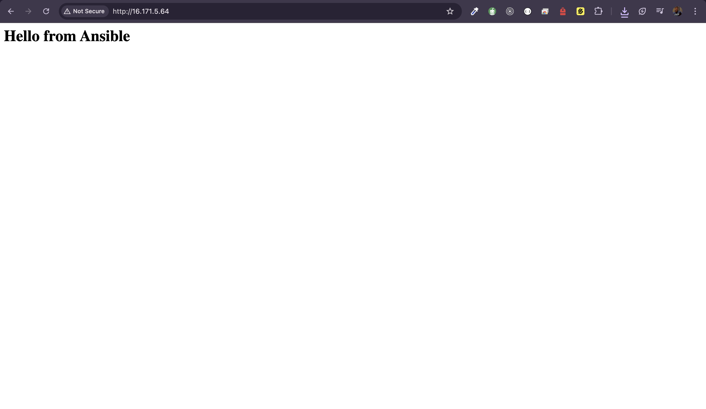

# 🚀 Project 2: Automated Provisioning with Ansible

Provision a remote Ubuntu EC2 instance with:
- ✅ NGINX installed and enabled
- ✅ Custom `index.html` deployed to `/var/www/html`

## 📦 Technologies Used
- Ansible
- Ubuntu EC2
- YAML, Bash

## 📂 Folder Structure
- `inventory.ini` – defines the target EC2 IP
- `playbook.yml` – contains Ansible tasks
- `files/index.html` – the custom HTML page to deploy

## 📜 Steps to Run

```bash
# 1. Set permissions for SSH key (if needed)
chmod 400 ~/.ssh/nginx-project-1.pem

# 2. Run the playbook
ansible-playbook -i inventory.ini playbook.yml
```

> 🔐 Ensure your SSH key is correctly referenced and your security group allows port 22 and 80.

## 🎯 Outcome
After execution, visiting the EC2 Public IP shows your custom `index.html`.

## 📸 Screenshot


## ✅ Status
Project Complete ✅
